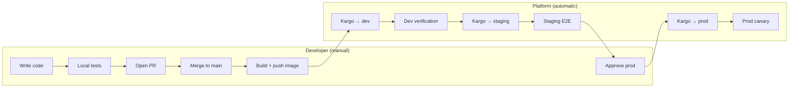
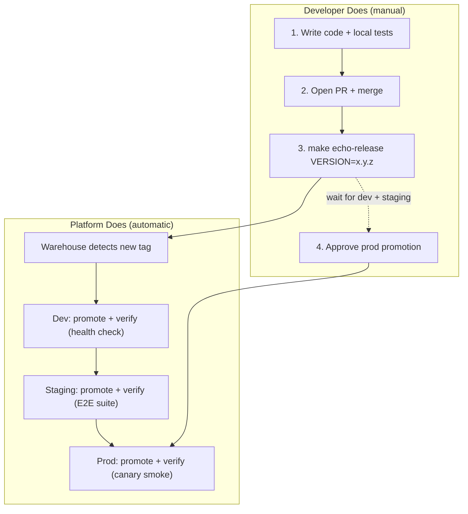

# Deployment Lifecycle: PR to Production

How code moves from a pull request to production. What the developer does
manually vs what the platform handles automatically.

## Overview



## Step-by-Step

### 1. Local Development (Developer)

```sh
cd apps/echo-server

# Write code, then validate
make test                        # Unit tests
make vet                         # Go vet
LOG_LEVEL=debug make run         # Run locally, check logs

# In another terminal, send traffic
cd apps/traffic-gen && make run

# Validate Helm charts render correctly
cd ../.. && make validate-chart
```

**See:** [Local Development Guide](../local-dev/README.md)

### 2. Open Pull Request (Developer)

Push your branch and open a PR against `main`.

**Before requesting review, verify:**

- [ ] `make echo-test` passes (unit tests)
- [ ] `make validate-chart` passes (Helm lint + template)
- [ ] `go vet ./...` clean in each changed app
- [ ] Tested locally with `LOG_LEVEL=debug make run`

### 3. Merge to Main (Developer)

After PR approval, merge to `main`. Nothing deploys yet — Kargo watches the
container registry, not git commits.

### 4. Build and Push Image (Developer)

```sh
make echo-release VERSION=0.2.0
```

This runs unit tests first, then builds an ARM64 image and pushes two tags:

- `ghcr.io/aroethe/homelab/echo-server:0.2.0`
- `ghcr.io/aroethe/homelab/echo-server:latest`

**This is the trigger.** Once the image is in the registry, the platform takes over.

If you also updated the E2E test suite, rebuild the test container:

```sh
make echo-e2e-push
```

### 5. Dev Deployment (Automatic)

**What happens:**

1. Kargo Warehouse polls GHCR (~5 min interval), discovers tag `0.2.0`
2. Creates a Freight object containing the image reference
3. Dev Stage auto-promotes: clones repo, updates `platform/overlays/echo-server/values-dev.yaml`, commits, pushes
4. ArgoCD syncs `echo-server-dev` to the `dev` namespace
5. Kargo runs the dev verification Job (curl health + echo check, ~15s)

**Where to watch:**

- Kargo UI: `http://<pi-ip>:30081` → Project: `echo-server` → Stage: `dev`
- ArgoCD UI: `http://<pi-ip>:30080` → Application: `echo-server-dev`
- CLI: `kubectl get promotions -n echo-server --sort-by=.metadata.creationTimestamp`

**If it fails:**

- Check verification Job logs: `kubectl logs -n echo-server -l kargo.akuity.io/stage=dev`
- Check pod status: `kubectl get pods -n dev`
- Check ArgoCD sync: `kubectl get app echo-server-dev -n argocd`
- Freight stays unverified in dev — staging won't receive it

### 6. Staging Deployment (Automatic)

**What happens:**

1. Dev verification passes → Freight is verified in dev
2. Staging Stage auto-promotes: updates `values-staging.yaml`, commits, pushes
3. ArgoCD syncs `echo-server-staging` to the `staging` namespace
4. Kargo runs the staging verification Job — the **full E2E test suite** (~30-60s):
   - API contract tests (all endpoints, required fields)
   - Header forwarding verification
   - 50 concurrent requests with zero failures
   - p99 latency under 500ms

**Where to watch:**

- Kargo UI: Project: `echo-server` → Stage: `staging`
- ArgoCD UI: Application: `echo-server-staging`
- CLI: `kubectl get promotions -n echo-server -l kargo.akuity.io/stage=staging`

**If it fails:**

- E2E test logs: `kubectl logs -n echo-server -l kargo.akuity.io/stage=staging`
- Freight stays unverified in staging — prod won't see it
- Fix the issue, push a new image tag, let it flow through dev again

### 7. Production Deployment (Manual Approval + Automatic Verification)

**This is the only manual step after the image push.**

The Freight has been verified in both dev and staging. It's now waiting for
human approval before entering prod.

**Option A — Kargo UI:**

1. Open `http://<pi-ip>:30081`
2. Navigate to Project: `echo-server` → Stage: `prod`
3. Find the pending Freight, click **Promote**

**Option B — Kargo CLI:**

```sh
kargo promote --project echo-server --stage prod
```

**Option C — kubectl:**

```sh
kubectl get freight -n echo-server --sort-by=.metadata.creationTimestamp
# Note the Freight name, then:
kubectl apply -f - <<EOF
apiVersion: kargo.akuity.io/v1alpha1
kind: Promotion
metadata:
  generateName: prod-
  namespace: echo-server
spec:
  stage: prod
  freight: <freight-name>
EOF
```

**What happens after approval:**

1. Kargo promotes: updates `values-prod.yaml`, commits, pushes
2. ArgoCD syncs `echo-server-prod` to the `prod` namespace
3. Kargo runs prod verification (~30s):
   - 10s settle wait
   - Health + readiness check
   - Functional verification (echo returns valid JSON)
   - 5 sequential latency checks, all under 1s
4. If verification passes → Freight is verified in prod, deployment complete
5. If verification fails → Freight is NOT verified, ArgoCD self-heals to the
   previous state

**Where to watch:**

- Kargo UI: Project: `echo-server` → Stage: `prod`
- ArgoCD UI: Application: `echo-server-prod`
- CLI: `kubectl get promotions -n echo-server -l kargo.akuity.io/stage=prod`

## Manual Smoke Tests (Optional)

At any point, you can run smoke tests from your dev machine:

```sh
make smoke-dev       # Test dev environment
make smoke-staging   # Test staging environment
make smoke-prod      # Test prod environment
make smoke-all       # Test all environments
```

## Summary: What's Manual vs Automatic



| Step                   | Who             | Action                            | Time                   |
| ---------------------- | --------------- | --------------------------------- | ---------------------- |
| Code + test locally    | Developer       | `make test`, `make run`           | —                      |
| Open PR                | Developer       | Push branch, open PR              | —                      |
| Merge to main          | Developer       | Merge after review                | —                      |
| Build + push image     | Developer       | `make echo-release VERSION=x.y.z` | ~2 min                 |
| Detect new tag         | Kargo Warehouse | Polls GHCR                        | up to 5 min            |
| Deploy to dev          | Kargo + ArgoCD  | Auto-promote, sync, verify        | ~1 min                 |
| Deploy to staging      | Kargo + ArgoCD  | Auto-promote, sync, E2E test      | ~2 min                 |
| Approve prod           | **Developer**   | Click approve in Kargo UI         | manual                 |
| Deploy to prod         | Kargo + ArgoCD  | Promote, sync, canary verify      | ~1 min                 |
| **Total (dev → prod)** |                 |                                   | **~10 min + approval** |

## Rollback

If something goes wrong in production:

1. **Automatic**: If prod verification fails, the Freight is not verified and
   ArgoCD's `selfHeal: true` keeps the previous working state
2. **Manual**: Push a new image with a higher semver tag containing the fix,
   let it flow through the pipeline again
3. **Emergency**: Manually update `platform/overlays/echo-server/values-prod.yaml`
   to pin a known-good tag, push to main — ArgoCD syncs immediately

## Links

| Resource      | URL                                     |
| ------------- | --------------------------------------- |
| Kargo UI      | `http://<pi-ip>:30081`                  |
| ArgoCD UI     | `http://<pi-ip>:30080`                  |
| Kargo Project | Kargo UI → echo-server                  |
| Promotions    | `kubectl get promotions -n echo-server` |
| Freight       | `kubectl get freight -n echo-server`    |
| Dev App       | ArgoCD UI → echo-server-dev             |
| Staging App   | ArgoCD UI → echo-server-staging         |
| Prod App      | ArgoCD UI → echo-server-prod            |
