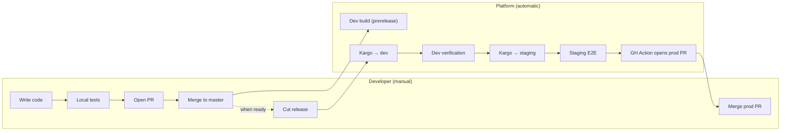
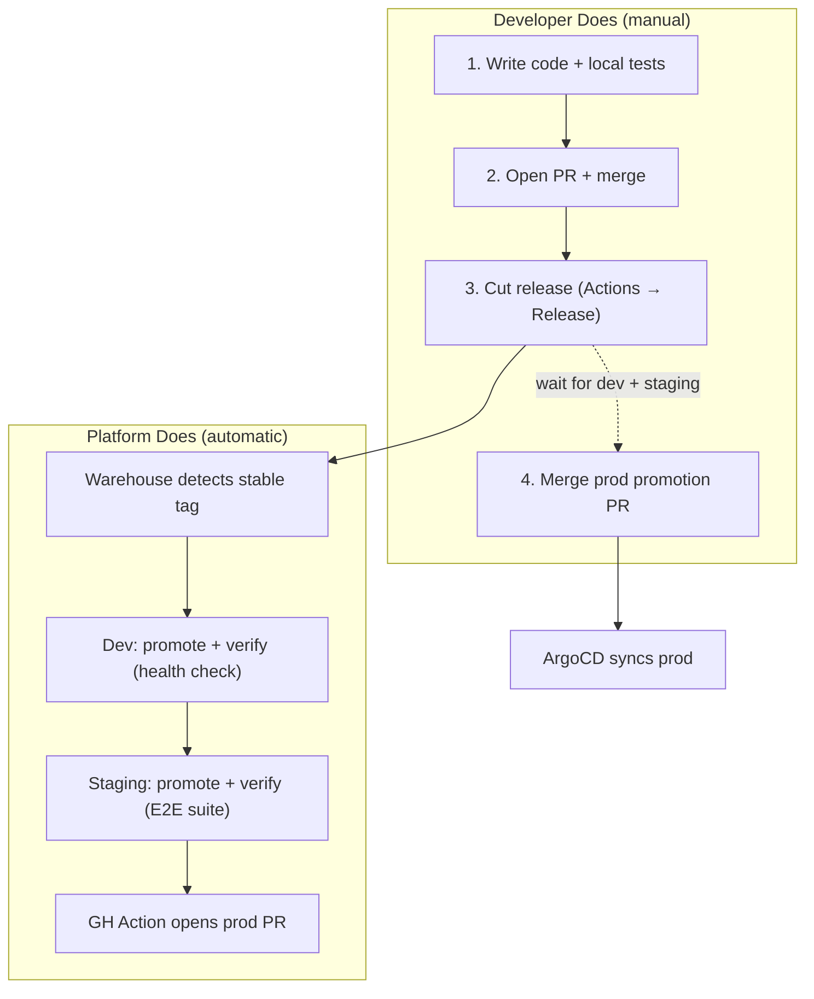

# Deployment Lifecycle: PR to Production

How code moves from a pull request to production. What the developer does
manually vs what the platform handles automatically.

## Overview



## Step-by-Step

### 1. Local Development (Developer)

```sh
cd apps/echo-server

# Write code, then validate
make test                        # Unit tests
make vet                         # Go vet
LOG_LEVEL=debug make run         # Run locally, check logs

# In another terminal, send traffic
cd apps/traffic-gen && make run

# Validate Helm charts render correctly
cd ../.. && make validate-chart
```

**See:** [Local Development Guide](../local-dev/README.md)

### 2. Open Pull Request (Developer)

Push your branch and open a PR against `master`.

**Before requesting review, verify:**

- [ ] `make echo-test` passes (unit tests)
- [ ] `make validate-chart` passes (Helm lint + template)
- [ ] `go vet ./...` clean in each changed app
- [ ] Tested locally with `LOG_LEVEL=debug make run`

### 3. Merge to Master (Developer)

After PR approval, merge to `master`.

### 4. Dev Build (Automatic)

The QA Build workflow triggers on every push to master that touches `apps/`.
It runs tests, creates a **prerelease** image tag (`X.Y.Z-dev.N`), and pushes
to GHCR.

**Kargo ignores prerelease tags.** These builds are for dev iteration only —
they don't trigger the promotion pipeline.

Monitor: **Actions tab** → `QA Build` workflow

### 5. Cut a Release (Developer — Manual)

When you're ready to promote through environments, cut a stable release:

Go to **Actions** → `Release` → **Run workflow**, pick the app and bump type
(patch/minor/major).

This creates a clean semver tag (e.g., `0.2.0`) and a GitHub Release with
changelog. **This is what triggers the promotion pipeline.**

### 6. Dev Deployment (Automatic)

**What happens:**

1. Kargo Warehouse polls GHCR (~5 min interval), discovers stable tag `0.2.0`
2. Creates a Freight object containing the image reference
3. Dev Stage auto-promotes: clones repo, updates `platform/apps/demo/dev/echo-server.yaml`, commits, pushes
4. ArgoCD syncs `echo-server-dev` to the `dev` namespace
5. Kargo runs the dev verification Job (curl health + echo check, ~15s)

**Where to watch:**

- Kargo UI: `http://<pi-ip>:30081` → Project: `echo-server` → Stage: `dev`
- ArgoCD UI: `http://<pi-ip>:30080` → Application: `echo-server-dev`
- CLI: `kubectl get promotions -n echo-server --sort-by=.metadata.creationTimestamp`

**If it fails:**

- Check verification Job logs: `kubectl logs -n echo-server -l kargo.akuity.io/stage=dev`
- Check pod status: `kubectl get pods -n dev`
- Check ArgoCD sync: `kubectl get app echo-server-dev -n argocd`
- Freight stays unverified in dev — staging won't receive it

### 7. Staging Deployment (Automatic)

**What happens:**

1. Dev verification passes → Freight is verified in dev
2. Staging Stage auto-promotes: updates `platform/apps/demo/staging/echo-server.yaml`, commits, pushes
3. ArgoCD syncs `echo-server-staging` to the `staging` namespace
4. Kargo runs the staging verification Job — the **full E2E test suite** (~30-60s):
   - API contract tests (all endpoints, required fields)
   - Header forwarding verification
   - 50 concurrent requests with zero failures
   - p99 latency under 500ms

**Where to watch:**

- Kargo UI: Project: `echo-server` → Stage: `staging`
- ArgoCD UI: Application: `echo-server-staging`
- CLI: `kubectl get promotions -n echo-server -l kargo.akuity.io/stage=staging`

**If it fails:**

- E2E test logs: `kubectl logs -n echo-server -l kargo.akuity.io/stage=staging`
- Freight stays unverified in staging — prod promotion PR won't open
- Fix the issue, cut a new release, let it flow through dev again

### 8. Production Deployment (PR-Gated)

**This is the approval gate.**

When Kargo promotes to staging (updating `platform/apps/demo/staging/echo-server.yaml`
on master), the `promote-prod.yaml` GH Action automatically opens a PR to update
the prod image tag.

**To deploy to prod:** review and merge the PR. ArgoCD auto-syncs from master.

The PR title follows the pattern: `promote(prod): echo-server vX.Y.Z`

PRs are labeled `promotion` for easy filtering.

**Where to watch:**

- GitHub → Pull Requests → filter by `promotion` label
- ArgoCD UI: Application: `echo-server-prod`

## Manual Smoke Tests (Optional)

At any point, you can run smoke tests from your dev machine:

```sh
make smoke-dev       # Test dev environment
make smoke-staging   # Test staging environment
make smoke-prod      # Test prod environment
make smoke-all       # Test all environments
```

## Summary: What's Manual vs Automatic



| Step                   | Who             | Action                             | Time                   |
| ---------------------- | --------------- | ---------------------------------- | ---------------------- |
| Code + test locally    | Developer       | `make test`, `make run`            | —                      |
| Open PR                | Developer       | Push branch, open PR               | —                      |
| Merge to master        | Developer       | Merge after review                 | —                      |
| Dev build (prerelease) | QA Build CI     | Auto — `X.Y.Z-dev.N` tag, no Kargo | ~2 min                 |
| Cut release            | **Developer**   | Actions → Release → Run workflow   | ~2 min                 |
| Detect stable tag      | Kargo Warehouse | Polls GHCR                         | up to 5 min            |
| Deploy to dev          | Kargo + ArgoCD  | Auto-promote, sync, verify         | ~1 min                 |
| Deploy to staging      | Kargo + ArgoCD  | Auto-promote, sync, E2E test       | ~2 min                 |
| Open prod PR           | GH Action       | Auto — opens PR with new tag       | ~1 min                 |
| Deploy to prod         | **Developer**   | Merge the promotion PR             | manual                 |
| **Total (dev → prod)** |                 |                                    | **~10 min + approval** |

## Rollback

If something goes wrong in production:

1. **Manual**: Push a new image with a higher semver tag containing the fix,
   let it flow through the pipeline again
2. **Emergency**: Manually update `platform/apps/demo/prod/echo-server.yaml`
   to pin a known-good tag, push to master — ArgoCD syncs immediately

## Links

| Resource      | URL                                         |
| ------------- | ------------------------------------------- |
| QA Build      | GitHub → Actions → `QA Build`               |
| Release       | GitHub → Actions → `Release` → Run workflow |
| GHCR Images   | `ghcr.io/aaronroethe/echo-server`           |
| Kargo UI      | `http://<pi-ip>:30081`                      |
| ArgoCD UI     | `http://<pi-ip>:30080`                      |
| Kargo Project | Kargo UI → echo-server                      |
| Promotions    | `kubectl get promotions -n echo-server`     |
| Freight       | `kubectl get freight -n echo-server`        |
| Dev App       | ArgoCD UI → echo-server-dev                 |
| Staging App   | ArgoCD UI → echo-server-staging             |
| Prod App      | ArgoCD UI → echo-server-prod                |
