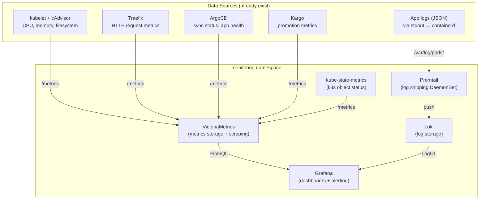

# Monitoring Stack

Self-hosted observability for the homelab: metrics, logs, dashboards, and alerting.
All open source, all ARM64 compatible, all running on the Pi.

## Stack



## Why This Stack

| Component              | Role                       | Why not alternatives                                                          |
| ---------------------- | -------------------------- | ----------------------------------------------------------------------------- |
| **VictoriaMetrics**    | Metrics storage + scraping | 3-5x less RAM than Prometheus for same data                                   |
| **Loki**               | Log aggregation            | Lightweight, designed for Grafana, indexes labels not content                 |
| **Promtail**           | Log shipper                | Simplest DaemonSet, auto-discovers pod logs                                   |
| **Grafana**            | Dashboards + alerting      | Industry standard, queries both VM and Loki                                   |
| **kube-state-metrics** | K8s object status          | Pod phase, deployment replicas, CronJob status — kubelet doesn't expose these |

## Resource Budget

| Component          | Request   | Limit     | Expected       |
| ------------------ | --------- | --------- | -------------- |
| VictoriaMetrics    | 64Mi      | 192Mi     | 80-120 MB      |
| Loki               | 48Mi      | 128Mi     | 60-80 MB       |
| Promtail           | 32Mi      | 64Mi      | 30-50 MB       |
| Grafana            | 64Mi      | 192Mi     | 80-120 MB      |
| kube-state-metrics | 16Mi      | 64Mi      | 30-50 MB       |
| **Total**          | **224Mi** | **640Mi** | **280-420 MB** |

Fits within the 500-700MB budget. With the rest of the platform (~2.3GB), total
idle usage is ~2.7GB leaving ~5.3GB for workloads.

## What You Can See

### Metrics (via VictoriaMetrics → Grafana)

| Question                  | Source             | Example Query                                          |
| ------------------------- | ------------------ | ------------------------------------------------------ |
| CPU/memory per pod        | kubelet/cAdvisor   | `container_memory_working_set_bytes{namespace="prod"}` |
| HTTP request latency      | Traefik            | `traefik_service_request_duration_seconds_bucket`      |
| Request rate by status    | Traefik            | `rate(traefik_service_requests_total[5m])`             |
| ArgoCD sync status        | ArgoCD             | `argocd_app_info{sync_status="Synced"}`                |
| Deployment replica health | kube-state-metrics | `kube_deployment_status_replicas_available`            |
| CronJob success/failure   | kube-state-metrics | `kube_cronjob_status_last_successful_time`             |
| Pod restarts              | kube-state-metrics | `kube_pod_container_status_restarts_total`             |

### Logs (via Loki → Grafana)

| Query                                                    | What it shows                     |
| -------------------------------------------------------- | --------------------------------- |
| `{namespace="prod"}`                                     | All prod logs                     |
| `{container="echo-server"} \| json`                      | Parsed JSON logs from echo-server |
| `{container="echo-server"} \| json \| duration_ms > 100` | Slow requests                     |
| `{container="echo-server"} \| json \| status >= 500`     | Server errors                     |
| `{namespace="dev"} \| json \| level="ERROR"`             | Errors in dev                     |

## What's Already Exposing Metrics (free)

These endpoints exist today with no extra work:

| Component             | Endpoint                  | Metrics                              |
| --------------------- | ------------------------- | ------------------------------------ |
| kubelet               | `:10250/metrics`          | Node-level resource usage            |
| cAdvisor (in kubelet) | `:10250/metrics/cadvisor` | Container CPU, memory, fs            |
| Traefik               | `:9100/metrics`           | HTTP requests, latency, status codes |
| ArgoCD server         | `:8083/metrics`           | App sync status, health              |
| ArgoCD controller     | `:8082/metrics`           | Reconciliation time                  |
| Kargo                 | various                   | Promotion, freight metrics           |
| CoreDNS               | `:9153/metrics`           | DNS query latency, errors            |

VictoriaMetrics auto-discovers these via `kubernetes_sd_configs`.

## Disk Usage

| Component       | Retention | Expected Disk       |
| --------------- | --------- | ------------------- |
| VictoriaMetrics | 14 days   | 200-500 MB          |
| Loki            | 7 days    | 100-300 MB          |
| Grafana         | —         | ~5 MB (SQLite)      |
| **Total**       |           | **300 MB - 800 MB** |

Store on USB drive at `/mnt/usb/monitoring/` alongside registry data.

## Deployment

Everything lives in a `monitoring` namespace, managed by ArgoCD.

### Directory Structure

```
platform/
  monitoring/
    install/
      namespace.yaml
      victoriametrics/
        deployment.yaml
        service.yaml
        configmap.yaml          # Prometheus scrape config
      loki/
        deployment.yaml
        service.yaml
        configmap.yaml          # loki.yaml
      promtail/
        daemonset.yaml
        configmap.yaml          # promtail.yaml
        serviceaccount.yaml
        clusterrole.yaml        # read pod logs + metadata
        clusterrolebinding.yaml
      grafana/
        deployment.yaml
        service.yaml            # NodePort :30082
        configmap.yaml          # datasource provisioning
      kube-state-metrics/
        deployment.yaml
        service.yaml
        serviceaccount.yaml
        clusterrole.yaml
        clusterrolebinding.yaml
  argocd/
    apps/
      monitoring.yaml           # ArgoCD Application
```

### ArgoCD Application

```yaml
apiVersion: argoproj.io/v1alpha1
kind: Application
metadata:
  name: monitoring
  namespace: argocd
  labels:
    homelab/tier: platform
    homelab/app: monitoring
spec:
  project: default
  source:
    repoURL: https://github.com/aroethe/homelab
    path: platform/monitoring/install
    targetRevision: main
    directory:
      recurse: true
  destination:
    server: https://kubernetes.default.svc
  syncPolicy:
    automated:
      prune: true
      selfHeal: true
    syncOptions:
      - CreateNamespace=true
```

### Key Configuration

**VictoriaMetrics scrape config** — auto-discovers all pods annotated with
`prometheus.io/scrape: "true"`, plus kubelet, cAdvisor, and API server:

```yaml
global:
  scrape_interval: 30s

scrape_configs:
  - job_name: kubernetes-nodes
    kubernetes_sd_configs:
      - role: node
    scheme: https
    tls_config:
      insecure_skip_verify: true
    bearer_token_file: /var/run/secrets/kubernetes.io/serviceaccount/token

  - job_name: kubernetes-cadvisor
    kubernetes_sd_configs:
      - role: node
    scheme: https
    metrics_path: /metrics/cadvisor
    tls_config:
      insecure_skip_verify: true
    bearer_token_file: /var/run/secrets/kubernetes.io/serviceaccount/token

  - job_name: kubernetes-pods
    kubernetes_sd_configs:
      - role: pod
    relabel_configs:
      - source_labels: [__meta_kubernetes_pod_annotation_prometheus_io_scrape]
        action: keep
        regex: true
      - source_labels: [__meta_kubernetes_pod_annotation_prometheus_io_port]
        action: replace
        target_label: __address__
        regex: (.+)
```

**Loki config** — monolithic mode, filesystem storage, 7-day retention:

```yaml
auth_enabled: false
server:
  http_listen_port: 3100
schema_config:
  configs:
    - from: 2024-01-01
      store: boltdb-shipper
      object_store: filesystem
      schema: v11
      index:
        prefix: index_
        period: 24h
storage_config:
  boltdb_shipper:
    active_index_directory: /data/loki/boltdb-shipper-active
    cache_location: /data/loki/boltdb-shipper-cache
    shared_store: filesystem
  filesystem:
    directory: /data/loki/chunks
limits_config:
  retention_period: 168h
compactor:
  working_directory: /data/loki/compactor
  shared_store: filesystem
  retention_enabled: true
```

**Grafana** — provisioned datasources, no manual setup needed:

```yaml
apiVersion: 1
datasources:
  - name: VictoriaMetrics
    type: prometheus
    url: http://victoriametrics.monitoring:8428
    isDefault: true
    access: proxy
  - name: Loki
    type: loki
    url: http://loki.monitoring:3100
    access: proxy
```

## Access

| Service               | URL                                                      |
| --------------------- | -------------------------------------------------------- |
| Grafana               | `http://grafana.homelab.local` or `http://<pi-ip>:30082` |
| VictoriaMetrics (API) | `http://victoriametrics.monitoring:8428` (in-cluster)    |
| Loki (API)            | `http://loki.monitoring:3100` (in-cluster)               |

## Optional: Add /metrics to echo-server

The Go app doesn't expose Prometheus metrics yet. Traefik already captures
request-level metrics from the outside, so this is optional. To add it:

```go
import "github.com/prometheus/client_golang/prometheus/promhttp"

mux.Handle("GET /metrics", promhttp.Handler())
```

Then add pod annotations so VictoriaMetrics auto-discovers it:

```yaml
# In chart/templates/deployment.yaml pod metadata
annotations:
  prometheus.io/scrape: "true"
  prometheus.io/port: "8080"
```

This gives you Go runtime metrics (goroutines, GC, heap) and the ability to
add custom counters.

## Alerting

Grafana has built-in alerting — no separate Alertmanager needed. Example alerts:

| Alert              | Condition                                                                      |
| ------------------ | ------------------------------------------------------------------------------ |
| Pod crash loop     | `kube_pod_container_status_restarts_total` increase > 3 in 10m                 |
| High memory        | `container_memory_working_set_bytes / container_spec_memory_limit_bytes > 0.9` |
| ArgoCD out of sync | `argocd_app_info{sync_status!="Synced"}` for 5m                                |
| HTTP 5xx spike     | `rate(traefik_service_requests_total{code=~"5.."}[5m]) > 0.1`                  |
| CronJob failed     | `kube_cronjob_status_last_successful_time` older than 2x schedule              |

Configure in Grafana UI → Alerting → Alert Rules. Notification channels:
webhook (simplest), email (needs SMTP), or just check the Grafana alerts page.

## Implementation Order

1. Create `platform/monitoring/install/` directory structure
2. Deploy namespace + kube-state-metrics (simplest, validates RBAC)
3. Deploy VictoriaMetrics + scrape config (verify metrics flow)
4. Deploy Loki + Promtail (verify logs flow)
5. Deploy Grafana with provisioned datasources
6. Add ArgoCD Application, push to main
7. Import dashboards (Node Exporter Full, K8s Cluster)
8. Set up basic alerts
