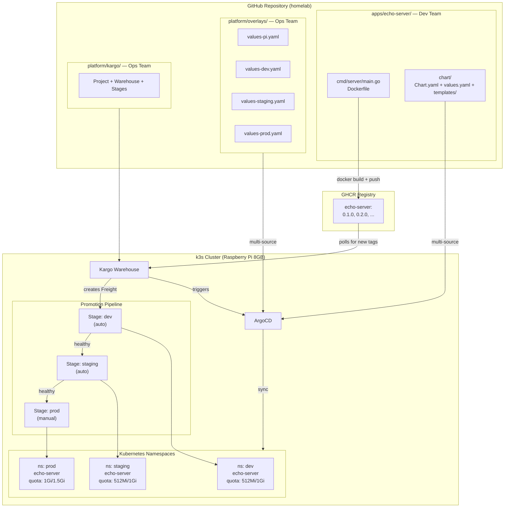
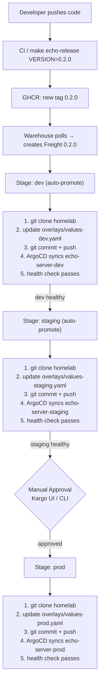
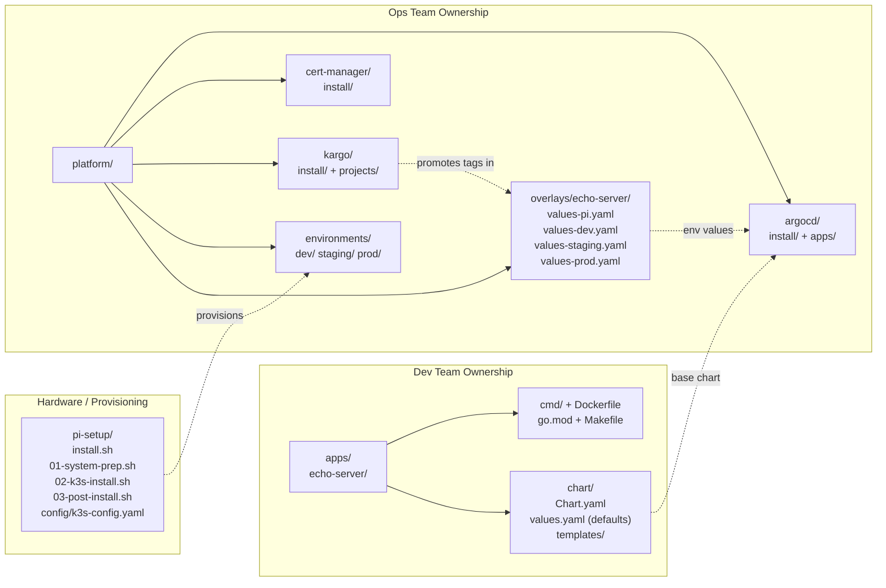

# Multi-Environment Deployment with Kargo

Progressive delivery across dev → staging → prod on a single Raspberry Pi, using
Kargo as the GitOps promotion engine on top of ArgoCD.

## Overview

"Environments" are Kubernetes namespaces on the same k3s cluster. The patterns
(Warehouse → Stage → Promotion) are identical to multi-cluster setups — when you
outgrow the Pi, you change ArgoCD Application `destination.server` values and
everything else stays the same.

## System Graph



## Data Flow



## Separation of Concerns



**Why this splits cleanly**: `apps/echo-server/` (code + chart) becomes its own repo.
`platform/` becomes the infra repo. `pi-setup/` becomes a provisioning repo. The only
change needed is updating `repoURL` fields in ArgoCD Applications and Kargo Stages.

## ArgoCD Multi-Source Pattern

Each per-env ArgoCD Application uses multi-source to combine the base chart
(from `apps/`) with overlay values (from `platform/`):

```yaml
apiVersion: argoproj.io/v1alpha1
kind: Application
metadata:
  name: echo-server-dev
  namespace: argocd
  labels:
    kargo.akuity.io/authorized-stage: echo-server:dev
spec:
  project: default
  sources:
    # Source 1: base chart from app code
    - repoURL: https://github.com/aroethe/homelab
      targetRevision: main
      path: apps/echo-server/chart
      helm:
        valueFiles:
          - $overlays/platform/overlays/echo-server/values-pi.yaml
          - $overlays/platform/overlays/echo-server/values-dev.yaml
    # Source 2: ref for overlay values files
    - repoURL: https://github.com/aroethe/homelab
      targetRevision: main
      ref: overlays
  destination:
    server: https://kubernetes.default.svc
    namespace: dev
```

The `$overlays` ref lets ArgoCD resolve values files from the second source
against the first source's Helm chart. This is what keeps app code and infra
config decoupled while still working together.

## Resource Budget

| Component                              | RAM           | Notes                                      |
| -------------------------------------- | ------------- | ------------------------------------------ |
| Existing (OS + k3s + ArgoCD + Traefik) | ~1,380 MB     | Already running                            |
| cert-manager (3 pods)                  | ~200 MB       | Required by Kargo for webhook TLS          |
| Kargo (4 pods)                         | ~400 MB       | controller, api, mgmt-controller, webhooks |
| 3x echo-server (dev/staging/prod)      | ~96 MB        | 32 MB each                                 |
| **Total**                              | **~2,076 MB** |                                            |
| **Remaining for future workloads**     | **~5,900 MB** |                                            |

## Kargo Concepts

| CRD           | Purpose                                                       | Count per app                     |
| ------------- | ------------------------------------------------------------- | --------------------------------- |
| **Project**   | Namespace + promotion policies for an app                     | 1                                 |
| **Warehouse** | Watches a source (registry, git, Helm repo) for new artifacts | 1                                 |
| **Freight**   | An immutable artifact reference (e.g., image tag 0.2.0)       | Created automatically             |
| **Stage**     | An environment. Defines how to promote Freight                | 1 per environment                 |
| **Promotion** | The act of moving Freight into a Stage                        | Created automatically or manually |

## Kargo CRD Definitions

### Project

```yaml
apiVersion: kargo.akuity.io/v1alpha1
kind: Project
metadata:
  name: echo-server
spec:
  promotionPolicies:
    - stage: dev
      autoPromotionEnabled: true
    - stage: staging
      autoPromotionEnabled: true
    - stage: prod
      autoPromotionEnabled: false
```

Creates an `echo-server` namespace where all Kargo resources for this app live.

### Warehouse

```yaml
apiVersion: kargo.akuity.io/v1alpha1
kind: Warehouse
metadata:
  name: echo-server
  namespace: echo-server
spec:
  subscriptions:
    - image:
        repoURL: ghcr.io/aroethe/homelab/echo-server
        semverConstraint: ">=0.1.0"
        discoveryLimit: 5
```

Polls GHCR every ~5 minutes. When it finds a new semver tag, it creates Freight.

**Implication**: Images must be tagged with semver (0.1.0, 0.2.0), not just `latest`.

### Stage: dev

```yaml
apiVersion: kargo.akuity.io/v1alpha1
kind: Stage
metadata:
  name: dev
  namespace: echo-server
spec:
  requestedFreight:
    - origin:
        kind: Warehouse
        name: echo-server
      sources:
        direct: true
  promotionTemplate:
    spec:
      steps:
        - uses: git-clone
          config:
            repoURL: https://github.com/aroethe/homelab
            checkout:
              - branch: main
                path: ./src
        - uses: helm-update-image
          as: update-image
          config:
            path: ./src/platform/overlays/echo-server/values-dev.yaml
            images:
              - image: ghcr.io/aroethe/homelab/echo-server
                key: image.tag
                value: Tag
        - uses: git-commit
          config:
            path: ./src
            messageFromSteps:
              - update-image
        - uses: git-push
          config:
            path: ./src
        - uses: argocd-update
          config:
            apps:
              - name: echo-server-dev
                sources:
                  - repoURL: https://github.com/aroethe/homelab
                    desiredRevision: ${{ outputs.steps['git-push'].commit }}
```

### Stage: staging

Same as dev, except:

```yaml
requestedFreight:
  - origin:
      kind: Warehouse
      name: echo-server
    sources:
      stages:
        - dev
```

Updates `platform/overlays/echo-server/values-staging.yaml` and syncs
`echo-server-staging` ArgoCD App.

### Stage: prod

Same pattern, except:

- `sources.stages: [staging]` — requires Freight verified in staging
- Updates `platform/overlays/echo-server/values-prod.yaml`, syncs `echo-server-prod`
- `autoPromotionEnabled: false` in Project — requires manual `kargo promote` or UI click

## Kargo Installation (via ArgoCD)

Kargo publishes an OCI Helm chart. Use ArgoCD multi-source to combine the chart
with our values file:

```yaml
apiVersion: argoproj.io/v1alpha1
kind: Application
metadata:
  name: kargo
  namespace: argocd
spec:
  project: default
  sources:
    - repoURL: oci://ghcr.io/akuity/kargo-charts/kargo
      targetRevision: "1.3.1"
      chart: kargo
      helm:
        valueFiles:
          - $values/platform/kargo/install/values.yaml
    - repoURL: https://github.com/aroethe/homelab
      targetRevision: main
      ref: values
  destination:
    server: https://kubernetes.default.svc
    namespace: kargo
```

### Kargo Helm Values (Pi-tuned)

```yaml
# platform/kargo/install/values.yaml
api:
  adminAccount:
    enabled: true
    tokenSigningKey: "" # openssl rand -base64 32
  service:
    type: NodePort
    nodePort: 30081 # Kargo UI access
  resources:
    requests: { cpu: 25m, memory: 64Mi }
    limits: { memory: 128Mi }

controller:
  resources:
    requests: { cpu: 25m, memory: 64Mi }
    limits: { memory: 256Mi }

managementController:
  resources:
    requests: { cpu: 10m, memory: 32Mi }
    limits: { memory: 128Mi }

webhooksServer:
  resources:
    requests: { cpu: 10m, memory: 32Mi }
    limits: { memory: 64Mi }
```

## Environment Namespaces

Each environment gets a namespace with a ResourceQuota to prevent resource starvation:

| Environment | Memory Request/Limit | CPU Request/Limit |
| ----------- | -------------------- | ----------------- |
| dev         | 512Mi / 1Gi          | 200m / 1 core     |
| staging     | 512Mi / 1Gi          | 200m / 1 core     |
| prod        | 1Gi / 1.5Gi          | 500m / 2 cores    |

## Manual Steps (not in git)

### 1. Git Credentials for Kargo

Kargo needs write access to the repo to commit tag updates:

```sh
kubectl create namespace echo-server

kubectl -n echo-server create secret generic git-credentials \
  --from-literal=repoURL=https://github.com/aroethe/homelab \
  --from-literal=username=aroethe \
  --from-literal=password=<GITHUB_PAT>

kubectl -n echo-server label secret git-credentials kargo.akuity.io/cred-type=git
```

The PAT needs `repo` scope (read/write access to repository contents).

### 2. Image Registry Credentials (if GHCR is private)

```sh
kubectl -n echo-server create secret generic image-credentials \
  --from-literal=repoURL=ghcr.io/aroethe/homelab/echo-server \
  --from-literal=username=aroethe \
  --from-literal=password=<GITHUB_PAT>

kubectl -n echo-server label secret image-credentials kargo.akuity.io/cred-type=image
```

### 3. Kargo Admin Token Signing Key

```sh
openssl rand -base64 32
# Set in platform/kargo/install/values.yaml → api.adminAccount.tokenSigningKey
```

## Installation Sequence

| Step | Command                                             | Wait for                             |
| ---- | --------------------------------------------------- | ------------------------------------ |
| 1    | `make argocd-install`                               | ArgoCD pods Running                  |
| 2    | `make argocd-bootstrap`                             | Root app synced                      |
| 3    | ArgoCD auto-syncs cert-manager, environments, Kargo | All pods Running                     |
| 4    | Apply git + image credential Secrets (manual)       | Secrets exist                        |
| 5    | `make kargo-projects`                               | Project + Warehouse + Stages created |
| 6    | `make echo-release VERSION=0.1.0`                   | Freight flows through pipeline       |

## Accessing UIs

| Service | URL                    | Credentials            |
| ------- | ---------------------- | ---------------------- |
| ArgoCD  | `http://<pi-ip>:30080` | `make argocd-password` |
| Kargo   | `http://<pi-ip>:30081` | `kargo login --admin`  |

## Known Considerations

**Git commit loops**: Kargo commits to the repo that ArgoCD watches. This is safe
because Kargo's `argocd-update` step pins ArgoCD to a specific commit SHA. ArgoCD
sees desired state = live state and does not re-sync.

**Semver discipline**: The Warehouse uses `semverConstraint`. Images must be tagged
with valid semver (0.1.0, 0.2.0), not `latest`. Use `make echo-release VERSION=x.y.z`.

**Single-branch model**: All environments' values files live on `main`. Kargo's
sequential commits (dev, then staging, then prod) avoid conflicts. If two Freight
items race, Kargo retries automatically.

**Scaling out**: When you add a second app, create a new directory under
`platform/kargo/projects/<app-name>/` with its own Project, Warehouse, and Stages.
Add per-env ArgoCD Applications and overlays. The pattern is identical.
