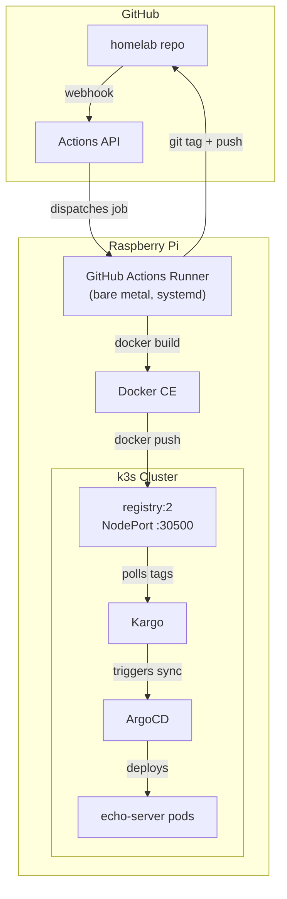
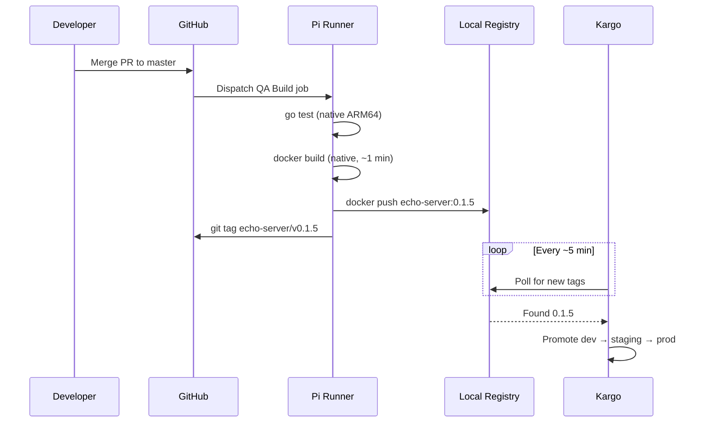

# Self-Hosted CI Runner and Container Registry

Run GitHub Actions builds and store container images locally on the Pi.
No external dependencies for CI/CD — everything runs on your hardware.

## Architecture



## Components

| Component             | Type                 | RAM                           | Purpose                     |
| --------------------- | -------------------- | ----------------------------- | --------------------------- |
| `registry:2`          | k3s Deployment       | ~30 MB                        | Container image storage     |
| GitHub Actions runner | Bare metal (systemd) | ~50 MB idle, ~300 MB building | CI job execution            |
| Docker CE             | Bare metal           | ~100 MB                       | Image builds (native ARM64) |

**Total added**: ~180 MB idle, ~430 MB during builds. Leaves ~5.5 GB free.

## Why Self-Hosted

|              | GitHub-Hosted             | Self-Hosted                     |
| ------------ | ------------------------- | ------------------------------- |
| ARM64 builds | QEMU emulation (~5 min)   | Native (~1 min)                 |
| Registry     | GHCR (internet roundtrip) | Local (milliseconds)            |
| Cost         | Free tier limits          | Free forever                    |
| Network      | Requires internet         | Works offline after setup       |
| Build cache  | GHA cache (limited)       | Docker layer cache (persistent) |

## Setup

### Step 1: Deploy the Registry

The registry is managed by ArgoCD (auto-syncs from `platform/registry/install/`).

If bootstrapping for the first time:

```sh
# Ensure the USB drive is mounted for image storage
sudo mkdir -p /mnt/usb/registry

# Install k3s registry mirror config
sudo cp pi-setup/config/registries.yaml /etc/rancher/k3s/registries.yaml
sudo systemctl restart k3s
```

ArgoCD will deploy the registry when the app-of-apps syncs. Verify:

```sh
curl http://registry.homelab.local:30500/v2/
# Expected: {}

curl http://registry.homelab.local:30500/v2/_catalog
# Expected: {"repositories":[]}
```

### Step 2: Install the GitHub Actions Runner

```sh
cd pi-setup
sudo bash 04-github-runner.sh
```

The script:

1. Installs Docker CE
2. Creates a `github-runner` user
3. Configures Docker for the insecure local registry
4. Downloads and registers the GitHub Actions runner
5. Installs it as a systemd service

You'll need a registration token from:
`https://github.com/AaronRoethe/homelab/settings/actions/runners/new`

### Step 3: Verify

```sh
# Runner is registered
sudo /opt/actions-runner/svc.sh status

# Push a test image
docker pull alpine:latest
docker tag alpine:latest registry.homelab.local:30500/test:v1
docker push registry.homelab.local:30500/test:v1

# Verify it's in the registry
curl -s http://registry.homelab.local:30500/v2/_catalog
# {"repositories":["test"]}

# Verify k3s can pull it
kubectl run test --image=registry.homelab.local:30500/test:v1 --rm -it -- echo "registry works"
```

## How Builds Work Now



No QEMU. No cross-compilation. No internet roundtrip for images.

## Registry Details

| Setting              | Value                                        |
| -------------------- | -------------------------------------------- |
| Address (NodePort)   | `registry.homelab.local:30500`               |
| Address (in-cluster) | `registry.registry.svc.cluster.local:5000`   |
| Storage              | `/mnt/usb/registry` (hostPath)               |
| TLS                  | None (insecure, local only)                  |
| Auth                 | None (not exposed externally)                |
| Delete enabled       | Yes (`REGISTRY_STORAGE_DELETE_ENABLED=true`) |

### Image References

Kargo and Helm charts use the in-cluster DNS so pods can pull images:

```
registry.registry.svc.cluster.local:5000/echo-server:0.1.5
```

The runner and `make` commands use the NodePort address:

```
registry.homelab.local:30500/echo-server:0.1.5
```

Both resolve to the same registry.

## Runner Management

```sh
# Status
sudo /opt/actions-runner/svc.sh status

# Logs
sudo journalctl -u actions.runner.*.service -f

# Restart
sudo /opt/actions-runner/svc.sh stop
sudo /opt/actions-runner/svc.sh start

# Re-register (if token expires)
cd /opt/actions-runner
sudo -u github-runner ./config.sh remove --token <TOKEN>
sudo -u github-runner ./config.sh --url https://github.com/AaronRoethe/homelab --token <NEW_TOKEN> --labels arm64,pi,homelab --name pi-runner --unattended --replace
```

## Storage Considerations

**Use a USB SSD**, not the SD card. Container image layers are write-heavy and
will wear out an SD card. Even a cheap 32 GB USB drive works.

```sh
# Mount USB drive
sudo mkdir -p /mnt/usb
echo '/dev/sda1 /mnt/usb ext4 defaults,noatime 0 2' | sudo tee -a /etc/fstab
sudo mount -a
```

To check registry disk usage:

```sh
du -sh /mnt/usb/registry/
```

To garbage collect unused layers:

```sh
kubectl exec -n registry deployment/registry -- registry garbage-collect /etc/docker/registry/config.yml
```
