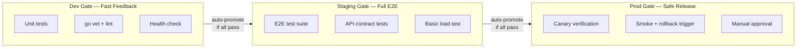
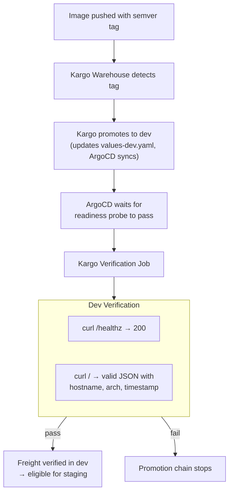
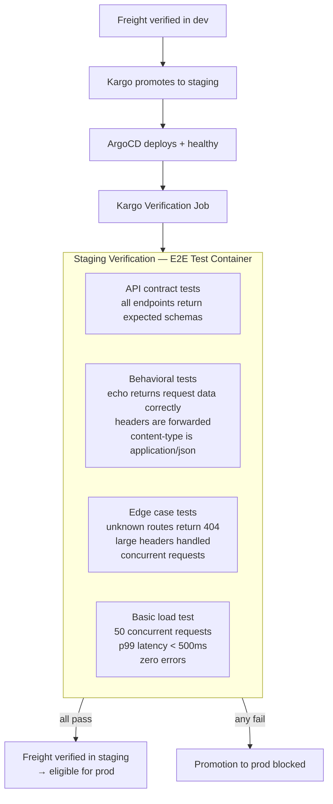
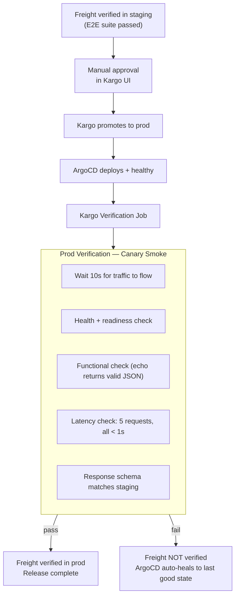
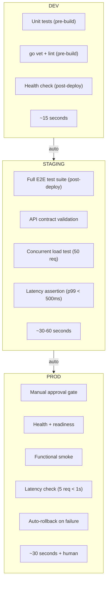

# Validation and E2E Testing Strategy

Application-level validation gates that get stricter as code moves through
environments. Infrastructure (ArgoCD, Kargo, cert-manager) already validates
itself via built-in mechanisms — this doc focuses on **your application code**.

## Built-in Infrastructure Validation (already handled)

These are not our concern — they're handled by the tools themselves:

| Tool             | Built-in Validation                                       | We Do Nothing                                                |
| ---------------- | --------------------------------------------------------- | ------------------------------------------------------------ |
| **ArgoCD**       | Sync status, health checks, auto-heal, degraded detection | ArgoCD won't report Healthy until pods pass readiness probes |
| **Kargo**        | Freight tracking, Stage health, promotion prerequisites   | Won't promote to staging until dev Stage reports healthy     |
| **k3s**          | kubelet liveness/readiness probes, pod restart policies   | Restarts unhealthy containers automatically                  |
| **Helm**         | Release status, rollback on failed install/upgrade        | ArgoCD handles this via sync                                 |
| **cert-manager** | Certificate ready conditions, auto-renewal                | Self-healing                                                 |

**We don't wrap these.** If ArgoCD says the app is Synced + Healthy, the
infrastructure is doing its job. Our validation is about: **does the application
actually work correctly?**

## Application Gate Strategy



| Environment | Gate Philosophy            | Test Type                              | Runs In                                 |
| ----------- | -------------------------- | -------------------------------------- | --------------------------------------- |
| **Dev**     | Fast, catch obvious breaks | Unit tests + health check              | CI + Kargo verification Job             |
| **Staging** | Thorough, catch real bugs  | E2E test suite against live deployment | Kargo verification Job (test container) |
| **Prod**    | Safe, verify after deploy  | Canary smoke + automatic rollback      | Kargo verification Job + manual gate    |

## Dev Gate: Fast Feedback

Goal: catch compilation errors, broken logic, and crashed processes in under 60 seconds.



### What Runs Before the Image is Built

Unit tests and linting run **before** the image is pushed. This is CI or local
`make test`:

```
apps/echo-server/
├── cmd/server/
│   └── main.go
├── internal/
│   └── handler/
│       ├── handler.go          # Extract handlers from main
│       └── handler_test.go     # Unit tests
├── go.mod
├── Makefile
└── Dockerfile
```

The echo-server Makefile `test` target runs `go test ./...` with race detection.
The `echo-release` target should run tests first:

```makefile
echo-release: echo-test       ## Build + push (tests must pass first)
echo-test:                    ## Run unit tests
    cd apps/echo-server && go test -race -count=1 ./...
```

### Kargo Dev Verification

After ArgoCD deploys and reports healthy, Kargo runs a lightweight
verification Job — just confirm the service responds correctly:

```yaml
# tests/kargo/echo-server-dev-verify.yaml
apiVersion: argoproj.io/v1alpha1
kind: AnalysisTemplate
metadata:
  name: echo-server-dev-verify
  namespace: echo-server
spec:
  metrics:
    - name: health-check
      provider:
        job:
          spec:
            backoffLimit: 1
            activeDeadlineSeconds: 30
            ttlSecondsAfterFinished: 120
            template:
              spec:
                restartPolicy: Never
                containers:
                  - name: verify
                    image: curlimages/curl:latest
                    imagePullPolicy: IfNotPresent
                    resources:
                      requests: { cpu: 5m, memory: 8Mi }
                      limits: { memory: 16Mi }
                    command: [sh, -c]
                    args:
                      - |
                        set -e
                        SVC="http://echo-server.dev.svc.cluster.local:80"
                        for i in 1 2 3; do
                          curl -sf --max-time 5 "$SVC/healthz" && break
                          sleep 3
                        done
                        curl -sf "$SVC/healthz" | grep -q '"status":"ok"'
                        curl -sf "$SVC/" | grep -q '"hostname"'
                        echo "dev gate passed"
```

Added to `stage-dev.yaml`:

```yaml
verification:
  analysisTemplates:
    - name: echo-server-dev-verify
```

**Time budget: ~15 seconds.**

## Staging Gate: Full E2E Test Suite

Goal: run a real test suite against the live staging deployment. This is where
you catch integration bugs, API contract violations, and regressions.



### E2E Test Container

The test suite is a Go test binary packaged as a container image. It runs as a
Kargo verification Job against the staging service.

```
apps/echo-server/
├── e2e/
│   ├── e2e_test.go             # Full E2E test suite
│   ├── Dockerfile              # Packages tests as a container
│   └── Makefile
```

**`e2e/e2e_test.go`** — tests run against the service URL passed via env var:

```go
// Tests run against a live deployment via SERVICE_URL env var
package e2e

import (
    "encoding/json"
    "net/http"
    "sync"
    "testing"
    "os"
)

var serviceURL = os.Getenv("SERVICE_URL")

func TestHealthEndpoint(t *testing.T) {
    resp, err := http.Get(serviceURL + "/healthz")
    // assert 200, body contains {"status":"ok"}
}

func TestEchoEndpoint(t *testing.T) {
    resp, err := http.Get(serviceURL + "/")
    // assert 200, JSON has hostname, timestamp, arch, headers, method, path
}

func TestEchoReturnsRequestHeaders(t *testing.T) {
    req, _ := http.NewRequest("GET", serviceURL+"/", nil)
    req.Header.Set("X-Test-Header", "hello")
    // assert response.headers contains X-Test-Header
}

func TestReadinessEndpoint(t *testing.T) {
    resp, err := http.Get(serviceURL + "/ready")
    // assert 200
}

func TestUnknownRouteReturns404(t *testing.T) {
    resp, err := http.Get(serviceURL + "/does-not-exist")
    // assert 404
}

func TestContentTypeIsJSON(t *testing.T) {
    resp, err := http.Get(serviceURL + "/")
    // assert Content-Type: application/json
}

func TestConcurrentRequests(t *testing.T) {
    var wg sync.WaitGroup
    errors := make(chan error, 50)
    for i := 0; i < 50; i++ {
        wg.Add(1)
        go func() {
            defer wg.Done()
            resp, err := http.Get(serviceURL + "/")
            // collect errors
        }()
    }
    // assert zero errors, all 200s
}

func TestResponseLatency(t *testing.T) {
    // 10 sequential requests, assert p99 < 500ms
}
```

**`e2e/Dockerfile`**:

```dockerfile
FROM golang:1.22-alpine AS build
WORKDIR /src
COPY go.mod go.sum* ./
RUN go mod download 2>/dev/null || true
COPY . .
RUN CGO_ENABLED=0 go test -c -o /e2e-tests ./e2e/

FROM gcr.io/distroless/static-debian12:nonroot
COPY --from=build /e2e-tests /e2e-tests
ENTRYPOINT ["/e2e-tests", "-test.v"]
```

### Kargo Staging Verification

The verification Job runs the E2E test container against the staging service:

```yaml
# tests/kargo/echo-server-staging-verify.yaml
apiVersion: argoproj.io/v1alpha1
kind: AnalysisTemplate
metadata:
  name: echo-server-staging-verify
  namespace: echo-server
spec:
  metrics:
    - name: e2e-tests
      provider:
        job:
          spec:
            backoffLimit: 0
            activeDeadlineSeconds: 120
            ttlSecondsAfterFinished: 300
            template:
              spec:
                restartPolicy: Never
                containers:
                  - name: e2e
                    image: ghcr.io/aroethe/homelab/echo-server-e2e:latest
                    imagePullPolicy: Always
                    resources:
                      requests: { cpu: 10m, memory: 32Mi }
                      limits: { memory: 64Mi }
                    env:
                      - name: SERVICE_URL
                        value: http://echo-server.staging.svc.cluster.local:80
```

Added to `stage-staging.yaml`:

```yaml
verification:
  analysisTemplates:
    - name: echo-server-staging-verify
```

**Time budget: ~30-60 seconds.** Includes test compilation (if not pre-compiled),
all API contract checks, concurrent load, and latency assertions.

### Building the E2E Image

```makefile
# In apps/echo-server/Makefile
e2e-build:          ## Build E2E test container (ARM64)
    docker buildx build --platform linux/arm64 -t $(REGISTRY)/echo-server-e2e:latest -f e2e/Dockerfile .

e2e-push:           ## Build and push E2E test container
    docker buildx build --platform linux/arm64 -t $(REGISTRY)/echo-server-e2e:latest -f e2e/Dockerfile --push .
```

The E2E image is rebuilt whenever tests change. It doesn't need to be versioned
with semver — `latest` is fine since the tests validate the _deployed_ service,
not themselves.

## Prod Gate: Safe Release

Goal: verify the deployment is healthy in production, with automatic rollback
if something is wrong. Combined with Kargo's manual approval gate.



### Why Prod is Different

Prod doesn't re-run the full E2E suite — staging already did that against the
same image. Prod verification answers a different question:
**"is this image healthy in the production namespace?"**

This catches:

- Environment-specific config errors (wrong secrets, missing env vars)
- Resource constraint issues (OOM under prod quota)
- Network policy or ingress misconfigs specific to prod

### Kargo Prod Verification

```yaml
# tests/kargo/echo-server-prod-verify.yaml
apiVersion: argoproj.io/v1alpha1
kind: AnalysisTemplate
metadata:
  name: echo-server-prod-verify
  namespace: echo-server
spec:
  metrics:
    - name: canary-smoke
      provider:
        job:
          spec:
            backoffLimit: 0
            activeDeadlineSeconds: 60
            ttlSecondsAfterFinished: 300
            template:
              spec:
                restartPolicy: Never
                containers:
                  - name: verify
                    image: curlimages/curl:latest
                    imagePullPolicy: IfNotPresent
                    resources:
                      requests: { cpu: 5m, memory: 8Mi }
                      limits: { memory: 16Mi }
                    command: [sh, -c]
                    args:
                      - |
                        set -e
                        SVC="http://echo-server.prod.svc.cluster.local:80"

                        echo "--- Waiting for traffic to settle ---"
                        sleep 10

                        echo "--- Health check ---"
                        curl -sf --max-time 5 "$SVC/healthz" | grep -q '"status":"ok"'
                        echo "PASS: /healthz"

                        echo "--- Readiness check ---"
                        curl -sf --max-time 5 "$SVC/ready" | grep -q '"status":"ok"'
                        echo "PASS: /ready"

                        echo "--- Functional check ---"
                        RESP=$(curl -sf --max-time 5 "$SVC/")
                        echo "$RESP" | grep -q '"hostname"'
                        echo "$RESP" | grep -q '"arch"'
                        echo "$RESP" | grep -q '"timestamp"'
                        echo "PASS: / returns valid response"

                        echo "--- Latency check (5 requests, all < 1s) ---"
                        for i in 1 2 3 4 5; do
                          TIME=$(curl -sf -o /dev/null -w "%{time_total}" --max-time 1 "$SVC/")
                          echo "  Request $i: ${TIME}s"
                        done
                        echo "PASS: latency within bounds"

                        echo "--- Prod gate passed ---"
```

Added to `stage-prod.yaml`:

```yaml
verification:
  analysisTemplates:
    - name: echo-server-prod-verify
```

### Automatic Rollback

If the prod verification Job fails (exit 1), the Freight is **not verified** in
prod. ArgoCD's `selfHeal: true` keeps the cluster in the last synced state.
The failed promotion is visible in the Kargo UI.

To recover: fix the issue, push a new image tag, let it flow through dev →
staging again, then re-approve for prod.

## Summary: Gate Comparison



|                 | Dev                             | Staging                                 | Prod                                 |
| --------------- | ------------------------------- | --------------------------------------- | ------------------------------------ |
| **Pre-build**   | `go test -race ./...`, `go vet` | —                                       | —                                    |
| **Post-deploy** | curl health + echo check        | Full E2E test container                 | Canary smoke + latency               |
| **Promotion**   | Auto                            | Auto (if E2E passes)                    | Manual approval + auto verification  |
| **On failure**  | Blocks staging                  | Blocks prod                             | ArgoCD self-heals, manual re-promote |
| **Runs as**     | Kargo verification Job (curl)   | Kargo verification Job (Go test binary) | Kargo verification Job (curl)        |
| **Time**        | ~15s                            | ~30-60s                                 | ~30s + human                         |

## File Structure

```
apps/echo-server/
├── cmd/server/main.go
├── internal/handler/
│   ├── handler.go              # Extracted handlers (testable)
│   └── handler_test.go         # Unit tests
├── e2e/
│   ├── e2e_test.go             # Full E2E suite (runs against live service)
│   └── Dockerfile              # Packages tests as container
├── Dockerfile
├── go.mod
└── Makefile                    # test, e2e-build, e2e-push targets

tests/kargo/
├── echo-server-dev-verify.yaml       # AnalysisTemplate: curl health check
├── echo-server-staging-verify.yaml   # AnalysisTemplate: E2E test container
└── echo-server-prod-verify.yaml      # AnalysisTemplate: canary smoke
```

## Makefile Targets

```
## --- App Testing ---
echo-test            Run unit tests (go test -race ./...)
echo-e2e-build       Build E2E test container (ARM64)
echo-e2e-push        Build and push E2E test container
echo-release         Build + push app image (runs echo-test first)

## --- Kargo Verification ---
kargo-verification   Apply all verification AnalysisTemplates

## --- Manual Smoke ---
smoke-dev            Smoke test dev from dev machine
smoke-staging        Smoke test staging from dev machine
smoke-prod           Smoke test prod from dev machine

## --- Validation ---
validate-chart       Helm lint + template + kubeconform
```

## Implementation Order

1. Extract handlers into `internal/handler/` and write unit tests
2. Add `echo-test` target, wire `echo-release` to depend on it
3. Create `tests/kargo/echo-server-dev-verify.yaml` — curl-based health check
4. Add `verification` stanza to `stage-dev.yaml`
5. Write `e2e/e2e_test.go` test suite and `e2e/Dockerfile`
6. Create `tests/kargo/echo-server-staging-verify.yaml` — E2E test container
7. Add `verification` stanza to `stage-staging.yaml`
8. Create `tests/kargo/echo-server-prod-verify.yaml` — canary smoke
9. Add `verification` stanza to `stage-prod.yaml`, add manual approval
10. Add all Makefile targets
